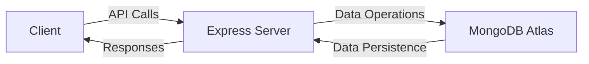

# 🛍️ Elevate | Modern E-Commerce Platform


A **production-ready** MERN stack e-commerce solution with role-based access control, secure authentication, and comprehensive inventory management.

## 🌟 Key Features

### 🔒 Secure Authentication System
- JWT-based session management with refresh tokens
- Role-based authorization (Admin/User)
- Nodemailer-powered email verification flow
- Password encryption & secure cookie handling

### 🧑‍💻 Customer Experience
- Responsive product catalog with filters
- Persistent shopping cart
- Seamless checkout flow
- Order history tracking

### 👔 Admin Dashboard
- Real-time user analytics
- CRUD operations for products
- Inventory management
- Order fulfillment tracking

## 🛠️ Technology Stack

| Layer        | Technologies                                                                 |
|--------------|------------------------------------------------------------------------------|
| **Frontend** | React 18, React Router 6, Context API, Axios, Tailwind CSS, Framer Motion    |
| **Backend**  | Node.js, Express, MongoDB (Atlas), Mongoose, JWT, Nodemailer, Bcrypt.js      |
| **DevOps**   | Docker-ready, CI/CD pipeline compatible, Environment variables management    |

## 🚀 Deployment Architecture



## 📦 Installation Guide

### Prerequisites
- Node.js v18+
- MongoDB Atlas account or local instance
- SMTP credentials (Mailtrap or SendGrid recommended)

### Setup Instructions

1. **Clone the repository**
   ```bash
   git clone https://github.com/SaqlainShahid/Clothing-store_fullstack-app_frontend.git
   cd Clothing-store_fullstack-app_frontend
   ```

2. **Configure backend**
   ```bash
   cd server
   cp .env.example .env
   # Edit .env with your credentials
   npm install
   npm run dev
   ```

3. **Configure frontend**
   ```bash
   cd ../client
   npm install
   npm start
   ```

## ⚙️ Environment Variables

### Server Configuration (`server/.env`)
```ini
# MongoDB Configuration
MONGO_URI=mongodb+srv://<username>:<password>@cluster.mongodb.net/elevate-store

# Authentication
JWT_SECRET=your_ultra_secure_secret
JWT_EXPIRES_IN=30d
COOKIE_EXPIRES_IN=30

# Email Service
EMAIL_HOST=smtp.mailservice.com
EMAIL_PORT=587
EMAIL_USER=your@email.com
EMAIL_PASS=your_password
EMAIL_FROM=Elevate Store <noreply@elevate-store.com>

# Client
CLIENT_URL=http://localhost:3000
```

## 📂 Project Structure

```
elevate-store/
├── client/                  # React Frontend
│   ├── public/              # Static assets
│   └── src/                 # Application source
│       ├── components/      # Reusable UI components
│       ├── contexts/        # Global state management
│       ├── pages/           # Route-level components
│       └── utils/           # Helper functions
│
└── server/                  # Express Backend
    ├── config/              # Environment configs
    ├── controllers/         # Route handlers
    ├── middleware/          # Authentication layers
    ├── models/              # MongoDB schemas
    ├── routes/              # API endpoints
    └── utils/               # Utility functions
```

## 🏆 Best Practices Implemented

- **Security**: Helmet.js for headers, CSRF protection, rate limiting
- **Performance**: React lazy loading, code splitting, MongoDB indexing
- **Maintainability**: ESLint + Prettier configuration, JSDoc documentation
- **Scalability**: Modular architecture, container-ready design

## 📈 Roadmap

### Q3 2024
- [ ] Stripe/PayPal integration
- [ ] Product review system
- [ ] Advanced analytics dashboard

### Q4 2024
- [ ] PWA implementation
- [ ] CI/CD pipeline
- [ ] Kubernetes deployment

## 📜 License

MIT License - Copyright © 2024 Saqlain Shahid  
[](https://opensource.org/licenses/MIT)

## 💌 Contact

For business inquiries or technical support:  
[](mailto:contact@saqlain.dev)  
[](https://linkedin.com/in/saqlain-shahid)  
[](https://twitter.com/SaqlainCodes)

---

**Elevate Your E-Commerce Experience**  
*"Where fashion meets technology"*
**see backend here**
```
https://github.com/SaqlainShahid/Clothing-store_fullstack-app_backend

