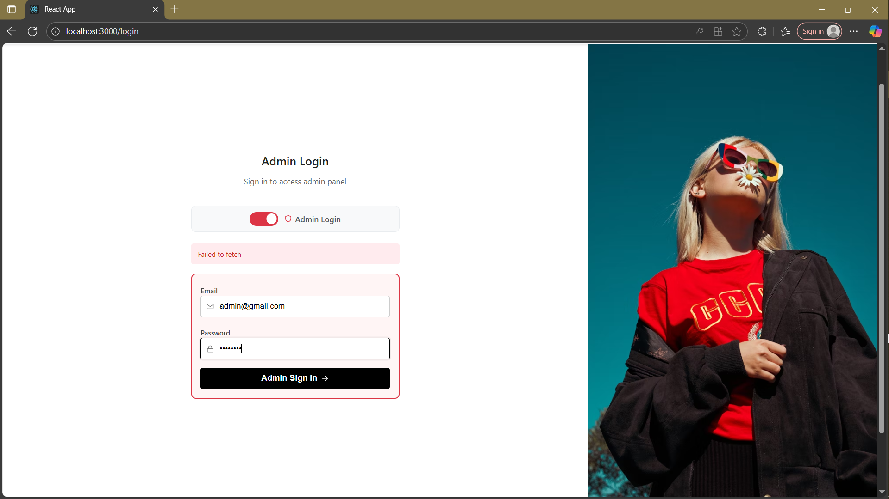

# 👕 Clothing Store Fullstack App

This is a complete **MERN stack (MongoDB, Express, React, Node.js)** e-commerce application featuring separate **Admin** and **User** panels. The project includes secure **JWT Authentication**, **email verification**, **product management**, **cart functionality**, and **order placement**.

## ✨ Features

### 🔐 Authentication
- JWT-based authentication
- Email verification on account creation
- Login / Signup for users
- Role-based access (Admin / User)

### 🛍️ User Panel
- Browse and view products
- Add products to cart
- View cart and checkout
- Place orders

### 🛠️ Admin Panel
- View all registered users
- Add, update, and delete products
- View all orders

## 🖼️ Screenshots



## 🏗️ Tech Stack

**Frontend:**  
- React  
- React Router  
- Axios  
- Tailwind CSS / CSS Modules (if used)

**Backend:**  
- Node.js  
- Express  
- MongoDB  
- Mongoose  
- JSON Web Token (JWT)  
- Nodemailer (for email verification)

## 📂 Folder Structure

```

/client         # React Frontend
/server         # Express Backend

````

## 🚀 Getting Started

### 1. Clone the Repository
```bash
git clone https://github.com/SaqlainShahid/Clothing-store_fullstack-app_frontend.git
````

### 2. Navigate to Folders and Install Dependencies

#### Frontend:

```bash
cd client
npm install
npm start
```

#### Backend:

```bash
cd server
npm install
npm run dev
```

### 3. Set Up `.env` Files

#### Backend `.env`

```env
MONGO_URI=your_mongodb_connection_string
JWT_SECRET=your_jwt_secret
EMAIL_USER=your_email@example.com
EMAIL_PASS=your_email_password
CLIENT_URL=http://localhost:3000
```

> 🔐 Make sure to replace sensitive values with your actual credentials.

## ✅ Future Improvements

* Payment integration (Stripe/PayPal)
* Product image uploads
* Admin analytics dashboard
* Order status tracking

## 🧑‍💻 Author

**Saqlain Shahid**
[GitHub](https://github.com/SaqlainShahid)

## 📄 License

This project is licensed under the [MIT License](LICENSE).

---

**Enjoy building and customizing this fullstack application!**


